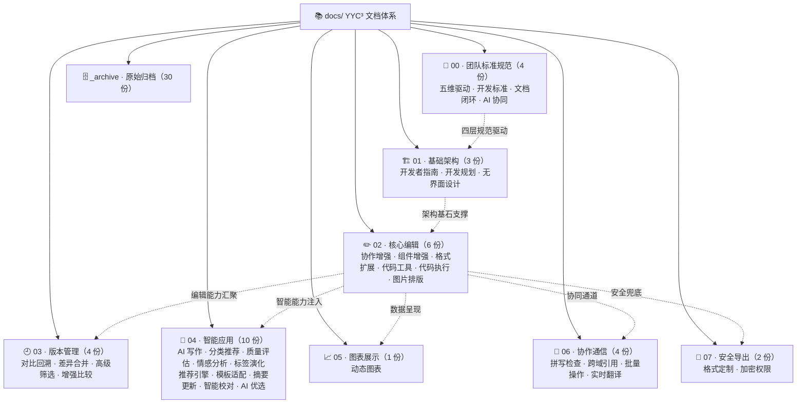
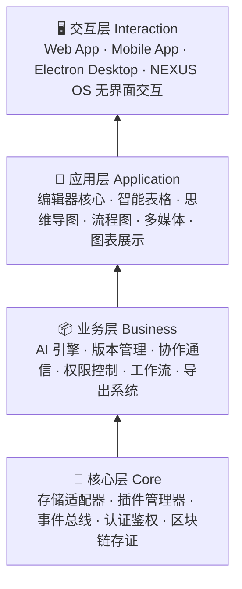

# YYC³ 云枢多维文档系统


> **Yunshu Multidimensional Intelligent Document — 言语³云枢多维智能文档**
>
> 五高架构 · 五标系统 · 五化转型 · 五维评估

---

## 徽章系统

### 仓库状态

[](https://github.com/YYC-Cube/YYC3-Yunshu-Multidimensional-Intelligent-Document)
[](./package.json)
[](./README.md#许可证)
[](https://github.com/YYC-Cube/YYC3-Yunshu-Multidimensional-Intelligent-Document)
[](https://github.com/YYC-Cube/YYC3-Yunshu-Multidimensional-Intelligent-Document)
[](https://github.com/YYC-Cube/YYC3-Yunshu-Multidimensional-Intelligent-Document/issues)
[](https://github.com/YYC-Cube/YYC3-Yunshu-Multidimensional-Intelligent-Document/pulls)

### 技术栈

[](./IMPLEMENTATION/)
[](./package.json)
[](./package.json)
[](./docs/YYC3-云枢智能-项目简述.md)
[](./docs/YYC3-云枢智能-项目简述.md)
[](./docs/YYC3-云枢智能-项目简述.md)
[](./docs/YYC3-云枢智能-项目简述.md)
[](./docs/YYC3-云枢智能-项目简述.md)

### 能力维度

[](./docs/README.md)
[](./docs/00-YYC3-团队通用-标准规范/)
[](./docs/04-YYC3-云枢智能-智能应用/)
[](./docs/06-YYC3-云枢智能-协作通信/)
[](./docs/07-YYC3-云枢智能-安全导出/)
[](./docs/01-YYC3-云枢智能-基础架构/)

---

## 项目简介

YYC³ 云枢多维文档系统（**Yunshu Multidimensional Intelligent Document**）是 YanYuCloudCube（言语³ 云枢）团队打造的下一代企业级多维智能文档协作平台，融合文档编辑、数据管理、AI 智能辅助与区块链存证等前沿技术，重新定义现代文档处理体验。

- **言启千行代码** — 以自然语言驱动智能文档创作
- **语枢万物智能** — 以语言为枢纽连接文档、数据与智能

### 核心亮点

| 能力 | 说明 |
| :----- | :----- |
| 🚀 多维文档处理 | 文档间智能关联与双向同步、模板变量系统、行业专用模板 |
| 🤖 AI 智能辅助 | 上下文感知写作助手、多维度质量评估、多语言摘要与实时翻译 |
| 🛡️ 企业级安全 | 区块链存证、动态水印、元素级细粒度权限与审计追踪 |
| 💻 多端协作 | 实时协同编辑与光标同步、Web / 移动 / 桌面统一体验、离线编辑 |
| 📊 数据可视化 | 智能表格、动态图表、思维导图多布局交互 |
| 🧩 插件化架构 | 核心 / 官方 / 社区 / 用户四层插件体系，热插拔机制 |

---

## 文档体系架构

### 体系总览



### 分层架构



### 文档索引

| 编号 | 领域 | 功能文档 | 文档索引 |
| :---: | :----- | :-------- | :-------- |
| 00 | **团队标准规范** | 五维驱动 · 开发标准 · 文档闭环 · AI 协同 | [进入](./docs/00-YYC3-团队通用-标准规范/) |
| 01 | **基础架构** | 开发者指南 · 开发规划 · 无界面设计 | [进入](./docs/01-YYC3-云枢智能-基础架构/README.md) |
| 02 | **核心编辑** | 协作增强 · 组件增强 · 格式扩展 · 代码工具 · 代码执行 · 图片排版 | [进入](./docs/02-YYC3-云枢智能-核心编辑/README.md) |
| 03 | **版本管理** | 对比回溯 · 差异合并 · 高级筛选 · 增强比较 | [进入](./docs/03-YYC3-云枢智能-版本管理/README.md) |
| 04 | **智能应用** | AI 写作 · 分类推荐 · 质量评估 · 情感分析 · 标签演化 · 推荐引擎 · 模板适配 · 摘要更新 · 智能校对 · AI 优选 | [进入](./docs/04-YYC3-云枢智能-智能应用/README.md) |
| 05 | **图表展示** | 动态图表 · 交互式可视化 · 数据绑定 | [进入](./docs/05-YYC3-云枢智能-图表展示/README.md) |
| 06 | **协作通信** | 拼写检查 · 跨域引用 · 批量操作 · 实时翻译 | [进入](./docs/06-YYC3-云枢智能-协作通信/README.md) |
| 07 | **安全导出** | 格式定制 · 加密权限 · 安全策略 | [进入](./docs/07-YYC3-云枢智能-安全导出/README.md) |

> 📖 完整索引见 [docs/README.md](./docs/README.md) · 功能映射见 [功能可视化架构](./docs/YYC3-云枢智能-功能可视化架构.md) · 项目全景见 [项目简述](./docs/YYC3-云枢智能-项目简述.md)

---

## 系统架构

```
┌──────────────────────────────────────────────────────────────────┐
│                        交互层 Interaction                         │
│  Web App · Mobile App · Electron Desktop · NEXUS OS 无界面交互   │
├──────────────────────────────────────────────────────────────────┤
│                        应用层 Application                         │
│  编辑器核心 · 智能表格 · 思维导图 · 流程图 · 多媒体 · 图表展示     │
├──────────────────────────────────────────────────────────────────┤
│                        业务层 Business                            │
│  AI 引擎 · 版本管理 · 协作通信 · 权限控制 · 工作流 · 导出系统     │
├──────────────────────────────────────────────────────────────────┤
│                        核心层 Core                                │
│  存储适配器 · 插件管理器 · 事件总线 · 认证鉴权 · 区块链存证       │
└──────────────────────────────────────────────────────────────────┘
```

### 关键技术选型

| 领域 | 技术方案 | 说明 |
| :----- | :--------- | :------ |
| 后端运行时 | Node.js + Express | REST API 服务，支持 HTTP / HTTPS 双模式 |
| 前端框架 | React + Next.js (App Router) | 服务端组件与客户端组件协同 |
| UI 组件 | shadcn/ui + Radix UI | 高可访问性组件原语 |
| 样式方案 | Tailwind CSS | 原子化 CSS 设计系统 |
| 包管理 | pnpm | 高性能依赖管理与 Monorepo 支持 |
| 实时协作 | WebSocket + CRDT | 多人实时协同编辑与冲突解决 |
| AI 集成 | 即梦 AI 模型 / 多模型适配 | 智能内容生成与分析 |
| 存储后端 | 适配器模式（IndexedDB / File System / Cloud API） | 用户自定义存储 |
| 版本控制 | Git-like 差异算法 | 文档版本历史与回溯 |
| 安全存证 | 区块链哈希存证 | 文档完整性验证与时间戳认证 |

### API 路由接口

| 端点 | 方法 | 描述 |
| :----- | :----: | :----- |
| `/` | GET | 服务状态页 |
| `/api/v1/docs` | POST | 创建新文档 |
| `/api/v1/docs/{doc_id}` | GET | 获取文档内容 |

---

## 项目结构

```
YYC3-Yunshu-Multidimensional-Intelligent-Document/
├── IMPLEMENTATION/                ← 功能实现源码
│   └── src/
│       ├── ai/                    ← AI 引擎（分析、视觉、内容处理）
│       ├── api/                   ← API 服务与路由
│       ├── core/                  ← 核心层（存储、插件、同步、文档模型）
│       ├── collaboration/         ← 协作与权限控制
│       ├── data/                  ← 数据模型（表格、文档）
│       ├── security/              ← 安全与权限扩展
│       └── ...
├── docs/                          ← 文档体系（7 大领域 · 30+ 功能文档）
│   ├── 00-YYC3-团队通用-标准规范/  ← 团队规范与标准
│   ├── 01-07-YYC3-云枢智能-*/      ← 功能领域文档
│   └── README.md                   ← 文档总索引
├── public/                        ← 静态资源（含 yyc3-family.png 品牌图）
├── test/                          ← 测试与用例
├── .env.example                   ← 环境变量模板
└── package.json
```

---

## 快速开始

### 环境要求

- Node.js ≥ 16
- npm / pnpm

### 安装依赖

```bash
npm install
```

### 配置环境变量

```bash
cp .env.example .env
# 编辑 .env 文件配置您的环境变量
```

### 启动服务

```bash
# 开发模式（nodemon 热重载）
npm run dev

# 生产模式（HTTP）
npm start

# 生产模式（HTTPS，需配置 cert.pem / key.pem）
npm run prod
```

服务默认监听 `http://localhost:3000`（可通过 `APP_PORT` 配置）；生产环境检测到 `cert.pem` 与 `key.pem` 后自动启用 HTTPS（443）并开启 HTTP → HTTPS 重定向。

### 运行测试

```bash
npm test
```

---

## 开发路线

| 阶段 | 目标 | 重点任务 |
| :----- | :----- | :--------- |
| **Phase 1** 基础建设 | 核心架构搭建 | 存储适配器、插件管理器、基础编辑器框架 |
| **Phase 2** 功能完善 | 编辑与协作体系 | 富文本编辑、实时协作、AI 写作、版本管理 |
| **Phase 3** 智能增强 | AI 全链路覆盖 | 情感分析、质量评估、标签演化、推荐引擎 |
| **Phase 4** 生态构建 | 开放平台建设 | 插件市场、SDK、API 标准化、第三方集成 |
| **Phase 5** 无界交互 | 下一代交互体验 | 语音交互、智能提示、NEXUS OS 无界面模式 |

---

## 贡献指南

我们欢迎任何形式的贡献！请先阅读 [团队开发标准](./docs/00-YYC3-团队通用-标准规范/YYC3-团队规范-开发标准.md) 与 [AI 协同开发文档](./docs/00-YYC3-团队通用-标准规范/YYC3-团队通用-开发文档.md)，遵循统一的代码规范、文档规范与五维评估标准后再提交。

贡献流程：

1. Fork 本仓库并创建特性分支
2. 遵循团队开发规范编写代码与文档
3. 提交变更并说明原因与影响范围
4. 创建 Pull Request 至 `main`

## 许可证

YYC³ 云枢多维文档系统采用 **Apache License 2.0** 开源许可证。

```text
Copyright 2026 YanYuCloudCube Team

Licensed under the Apache License, Version 2.0 (the "License");
you may not use this file except in compliance with the License.
You may obtain a copy of the License at

http://www.apache.org/licenses/LICENSE-2.0

Unless required by applicable law or agreed to in writing, software
distributed under the License is distributed on an "AS IS" BASIS,
WITHOUT WARRANTIES OR CONDITIONS OF ANY KIND, either express or implied.
See the License for the specific language governing permissions and
limitations under the License.
```

---

## 联系我们

- 📧 邮箱：[admin@0379.email](mailto:admin@0379.email)
- 🌐 团队：YanYuCloudCube（言语³ 云枢）
- ⭐ 开源仓库：[YYC-Cube/YYC3-Yunshu-Multidimensional-Intelligent-Document](https://github.com/YYC-Cube/YYC3-Yunshu-Multidimensional-Intelligent-Document)

---

> **言启千行代码，语枢万物智能** — *YYC³ MID Team*
>
> *Words Initiate Quadrants, Language Serves as Core for the Future*
>
> **© 2025-2026 YanYuCloudCube™. All Rights Reserved.**
